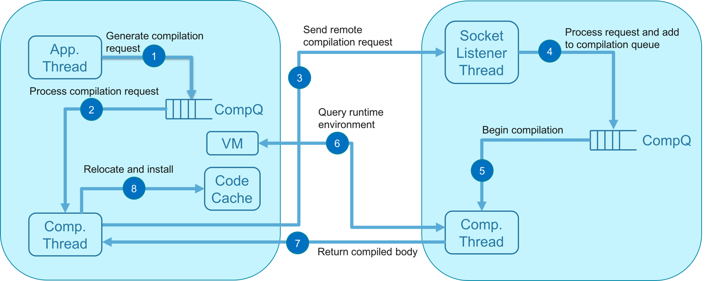

Compilation lifecycle:

1. Compilation request is generated on the client and added to compilation queue
1. Request is popped from queue and assigned a compilation thread
1. Compilation thread serializes compilation request and sends it to the server
1. Server listener thread receives request and adds it to the server compilation queue
1. Server pops compilation from queue and assigns to a compilation thread
1. Queries are sent to the client to inquire about the VM or compilation options
1. A final message is sent which includes the compiled code
1. Client relocates and installs the code

